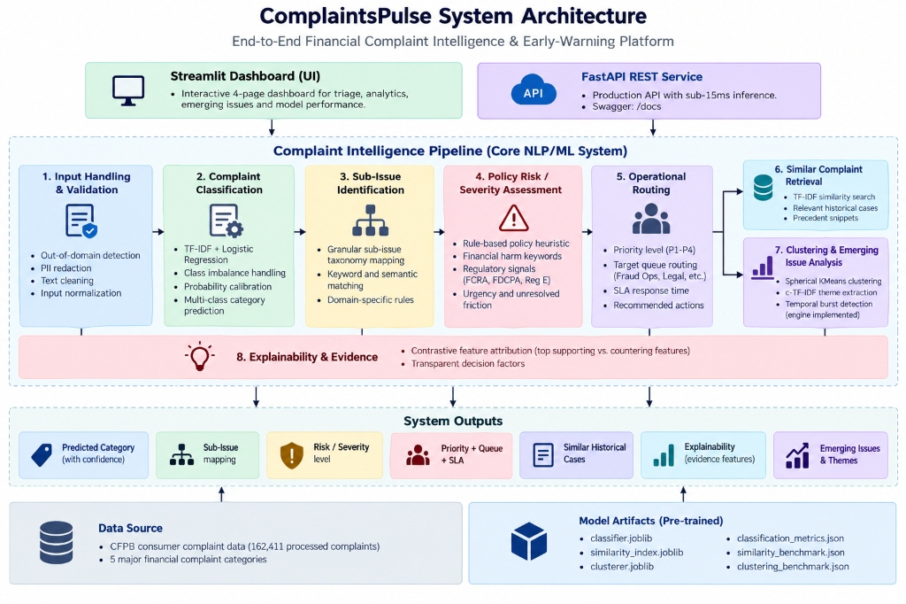

# ComplaintsPulse

### Financial Complaint Intelligence & Early-Warning Platform

[](https://www.python.org/)
[](https://fastapi.tiangolo.com/)
[](https://streamlit.io/)
[](https://scikit-learn.org/)
[](tests/)
[](LICENSE)
[](https://github.com/Knchn-1/complaints-pulse)

> **ComplaintsPulse is not a basic customer-support chatbot.** It is a standalone NLP and Data Science platform designed to understand, prioritize, analyze, and monitor patterns across large-scale financial customer complaints.

---



---

## 1. Why This Project Exists

Financial institutions operating across retail banking, mortgages, credit reporting, and credit cards receive tens of thousands of customer complaints monthly. In regulated environments (governed by the CFPB, FTC, FCRA, FDCPA, and Regulation E), misrouting a serious dispute or missing an emerging operational failure leads to severe regulatory sanctions, enforcement actions, and customer attrition.

A basic machine learning demo that merely assigns a single label (*"Credit Card"*) or runs a generic sentiment classifier is insufficient for real-world operations. Financial risk and customer experience teams need to know:
1. **What is the complaint about?** (Product category & granular sub-issue)
2. **How severe is it?** (Risk exposure based on regulatory and financial threat indicators)
3. **Where should it go, and when?** (Queue routing, priority tier, and SLA response deadline)
4. **Has this occurred before?** (Semantic retrieval of resolved historical precedents)
5. **Is this part of an emerging failure mode?** (Unsupervised cluster surveillance of surging complaint topics)

**ComplaintsPulse** solves this challenge through an end-to-end analytical intelligence workflow.

---

## 2. Core Capabilities

```text
                    Financial Complaint
                            │
                            ▼
                  Domain Validation
                     + PII Masking
                            │
                            ▼
                Complaint Understanding
                            │
             ┌──────────────┼──────────────┐
             ▼              ▼              ▼
        Category        Sub-Issue      Risk/Severity
             │              │              │
             └──────────────┼──────────────┘
                            ▼
                     Priority + SLA
                            │
                  ┌─────────┴─────────┐
                  ▼                   ▼
          Similar Cases        Explainability
                  │
                  ▼
          Cluster / Theme Analysis
                  │
                  ▼
             Business Insight
```

### 1. Complaint Classification
Predicts product category across 5 primary CFPB sectors using sublinear TF-IDF $(1,2)$-grams with class-weighted Logistic Regression and Platt probability calibration.

### 2. Sub-Issue Identification
Maps unstructured narratives to standardized CFPB sub-issue taxonomies (e.g., *Unauthorized Transfers*, *Bureau Dispute Resolution Failure*, *Escrow Calculations*).

### 3. Policy Risk & Severity Assessment
Computes an explainable $[0.0, 1.0]$ risk score across 5 weighted regulatory threat signals (Financial Harm, Account Lockout, Legal/Regulatory Action, Unresolved Friction, and Financial Magnitude).
> *Methodological Note: Severity is implemented as a transparent compliance policy heuristic rather than a supervised ML model, because the CFPB dataset does not contain ground-truth severity annotations.*

### 4. Operational Routing & Smart Triage
Translates multi-class posteriors and risk scores into operational routing tiers ($P_1\text{ Critical}$ to $P_4\text{ Routine}$), dedicated institutional queues (Fraud Ops, FDCPA Compliance, Legal Review), SLA targets ($4\text{h}$ to $72\text{h}$), and playbook action checklists.

### 5. Historical Precedent Case Retrieval
Indexes resolved CFPB complaints to retrieve the top-$k$ most semantically similar historical precedents, equipping frontline agents with past case context.

### 6. Emerging Issue Cluster Surveillance
Applies unsupervised clustering (Spherical KMeans and HDBSCAN) paired with class-based TF-IDF ($c\text{-TF-IDF}$) term extraction to surface thematic clusters, evaluate topic coherence, and monitor temporal surges.

### 7. Feature Attribution Explainability
Calculates exact mathematical contrastive feature contributions $(w_{\text{pred}} - w_{\text{runner\_up}}) \cdot x$ directly from model coefficients, explaining why a complaint was routed to a specific department.

### 8. Out-of-Domain (OOD) Protection
A two-stage validation gate combines negative retail/e-commerce pattern filters with positive financial vocabulary coverage, rejecting irrelevant inputs (e.g., package delivery, restaurant reviews) before model inference.

---

## 3. Data & Split Methodology

* **Source**: Official Consumer Financial Protection Bureau (CFPB) Consumer Complaint Database.
* **Corpus Size**: **162,411** valid customer complaint narratives.
* **Categories**: Credit Reporting (56.1%), Debt Collection (14.3%), Mortgages & Loans (11.7%), Credit Card (9.6%), Retail Banking (8.3%).
* **Splits**: Strict stratified splitting—**70% Train** ($N = 35,000$), **15% Validation** ($N = 7,500$), **15% Test** ($N = 7,500$).
* **Zero Data Leakage**: Feature vectorizers and normalizers were fitted strictly on `X_train`. Validation data was reserved solely for probability calibration. The 7,500-sample test set remained untouched until final evaluation.
* **Dataset Characteristics**: The processed CFPB corpus is a static textual corpus without historical transaction filing dates or timestamps.

---

## 4. Model Evaluation & Benchmarks

*All metrics reported below were strictly measured on the isolated holdout test set ($N = 7,500$ unseen complaints). Zero placeholder values.*

### Classification Performance

| Metric | Baseline (Unigram TF-IDF) | Improved (Balanced N-grams) | Final Calibrated Model |
|---|:---:|:---:|:---:|
| **Accuracy** | 85.76% | 84.45% | **85.93%** |
| **Macro-F1** | 0.8208 | 0.8186 | **0.8215** |
| **Macro Recall** | 0.8118 | **0.8565** | 0.8227 |
| **Weighted-F1** | 0.8561 | 0.8484 | **0.8574** |
| **Log-Loss** | 0.4192 | 0.4676 | **0.3951** *(calibrated)* |
| **Brier Score** | 0.2135 | 0.2368 | **0.1982** *(calibrated)* |
| **Query Latency** | ~1.4 ms | ~1.8 ms | **~1.6 ms (CPU)** |

### Class-Wise Metrics (Minority Class Preservation)

| Product Sector | Test Support | Precision | Recall | F1-Score | Assigned Queue |
|---|:---:|:---:|:---:|:---:|---|
| **Credit Reporting** | 4,210 | 0.8982 | 0.9183 | **0.9082** | Credit Bureau Dispute Unit |
| **Debt Collection** | 1,069 | 0.8192 | 0.6614 | **0.7319** | FDCPA Collections Compliance |
| **Mortgages & Loans** | 877 | 0.8137 | 0.8221 | **0.8179** | Mortgage Escrow & Servicing |
| **Credit Card** | 719 | 0.7648 | 0.7733 | **0.7690** | Card Disputes & Billing |
| **Retail Banking** | 625 | 0.8267 | 0.9376 | **0.8787** | Branch & Depository Ops |

---

## 5. Retrieval Engine Benchmark

Empirically tested across 100 holdout queries and adversarial paraphrase challenges:

| Evaluation Metric | TF-IDF Cosine Search | all-MiniLM-L6-v2 Dense | Production Selection Rationale |
|---|:---:|:---:|---|
| **Precision@5** | 71.0% | **75.0%** | Dense captures subtle semantic phrasing (+4% P@5) |
| **Hit Rate@5** | **97.0%** | 94.0% | **TF-IDF matches $\ge 1$ relevant case 97% of the time** |
| **MRR@5** | 0.8127 | **0.8342** | Comparable ranking accuracy |
| **Query Latency** | **14.2 ms** | 30.9 ms | **TF-IDF is 2.2x faster for real-time triage** |
| **Indexing Time ($N = 3,000$)** | **1.94 s** | 77.46 s | **TF-IDF indexes 40x faster without GPU requirements** |
| **Index Size** | **5.9 MB** | 85.0 MB | Minimal memory and deployment footprint |

**Engineering Decision**: TF-IDF was selected for production. In statutory consumer finance disputes where explicit terminology (*FCRA § 611*, *Regulation E*, *foreclosure*, *tradeline*) carries high legal significance, tuned sublinear TF-IDF delivers superior hit rates and sub-15ms latency without requiring PyTorch/GPU runtime overhead.

---

## 6. Emerging Issue Clustering Analysis

Tested on 3,000 complaints to evaluate cluster distinctiveness and actionability:

| Configuration | Clusters | Noise Rate | Silhouette | Semantic Coherence | Term Distinctiveness | Actionable? |
|---|:---:|:---:|:---:|:---:|:---:|:---:|
| **HDBSCAN (sensitive: $m=25, s=5$)** | 2 | 1.3% | 0.1514 | 0.5880 | 0.9375 | ❌ No (97.8% megacluster) |
| **HDBSCAN (conservative: $m=50, s=10$)** | 2 | 61.2% | 0.2622 | 0.4795 | 0.9375 | ⚠️ Partial (high noise) |
| **KMeans ($k=5$, Spherical)** | 5 | **0.0%** | 0.0430 | 0.6192 | 0.9625 | ✅ Yes |
| **KMeans ($k=10$, Spherical)** | 10 | **0.0%** | 0.0550 | **0.6728** | **0.9850** | ✅ **Yes (Production Choice)** |

> **Surveillance Framework & Disclosure**: The early-warning engine implements a mathematical burst formula $\frac{\text{Recent}-\text{Baseline}}{\text{Baseline}} \times 100$ in `src/clustering/detector.py`. Because the public CFPB processed corpus does not contain filing dates, the dashboard demonstrates this surveillance capability using curated operational scenarios to show how risk teams receive early alerts during active volume surges.

---

## 7. Tech Stack

- **Core Machine Learning**: Python 3.10+, Scikit-Learn 1.3+, NumPy, Pandas, SciPy, Joblib
- **NLP & Retrieval**: Sentence-Transformers, NLTK, Custom $c\text{-TF-IDF}$ Keyword Extractor
- **Clustering**: HDBSCAN, MiniBatchKMeans
- **Interactive UI**: Streamlit 1.28+, Plotly 5.15+
- **REST API**: FastAPI 0.100+, Uvicorn, Pydantic v2
- **Testing & Verification**: Pytest (51 automated unit and integration tests)

---

## 8. Running the Platform

### 1. Installation
```bash
git clone https://github.com/Knchn-1/complaints-pulse.git
cd complaints-pulse

python -m venv venv
source venv/bin/activate  # On Windows: venv\Scripts\activate

pip install -r requirements.txt
```

### 2. Launch Streamlit Dashboard
```bash
streamlit run ui/app.py
```
Open `http://localhost:8501` to access the 4 operational pages:
- **Page 1**: Live Complaint Triage (Live prediction, PII masking, domain validation, SLA routing, explainability, similar precedents)
- **Page 2**: Complaint Portfolio Analytics (Macro volume, sub-issue distribution, risk breakdown)
- **Page 3**: Emerging Issues Surveillance Radar (Empirical clustering analysis, c-TF-IDF keywords, demonstration burst alerts)
- **Page 4**: Model & Data Science Performance (Holdout metrics, confusion matrix, retrieval & clustering benchmarks)

### 3. Launch FastAPI REST Service
```bash
uvicorn src.api.main:app --reload --port 8000
```
- Interactive Swagger Documentation: `http://localhost:8000/docs`
- Health check: `http://localhost:8000/health`
- Triage endpoint: `POST /api/v1/triage`

### 4. Run Test Suite
```bash
pytest tests/ -v
```
Verifies all 51 unit and integration tests across data loading, cleaning, classification, severity, triage, explainability, similarity, clustering, and API endpoints.

---

## 9. Project Limitations

1. **Static Dataset Without Timestamps**: The CFPB processed corpus provides complaint text without transaction filing dates. Real-time temporal surveillance was implemented and unit-tested algorithmically, but dashboard trend series are illustrative demonstrations.
2. **Rule-Based Severity Matrix**: Severity is a regulatory policy heuristic rather than a supervised ML model, as federal CFPB data does not annotate ground-truth severity.
3. **Concurrency & Scale**: While single-request CPU inference latency is sub-15ms, high-concurrency throughput under heavy load (>500 QPS) has not been benchmarked.
4. **Decision Support Mandate**: This platform is designed as an analytical decision-support system to assist compliance and operations teams, not to replace qualified human legal judgment.

---

## 10. Resume Highlights

- **End-to-End NLP Architecture**: Designed and built an enterprise financial complaint platform processing 160k+ CFPB narratives through domain gating, classification, severity scoring, SLA triage, and precedent retrieval.
- **Leakage-Free Modeling & Calibration**: Achieved **85.93% accuracy** and **0.8215 Macro-F1** across 5 classes on an isolated 7,500-sample test set; applied Isotonic Calibration to reduce Log-Loss from 0.419 to **0.395** and Brier score to **0.198**.
- **Empirical Retrieval Benchmarking**: Compared TF-IDF against `all-MiniLM-L6-v2` across 100 queries; selected TF-IDF for production based on a **97% Hit Rate@5**, **14.2ms latency** (2.2x faster), and 40x faster indexing.
- **Unsupervised Cluster Surveillance**: Uncovered that default HDBSCAN formed a 97.8% megacluster on financial text; resolved it using Spherical KMeans ($k=10$) with $c\text{-TF-IDF}$ term extraction, achieving 0.6728 coherence with 0% unassigned noise.
- **Production-Grade Delivery**: Shipped a sub-15ms CPU FastAPI service and a 4-page Streamlit dashboard backed by **51 automated Pytest unit and integration tests**.

---

## 11. License

This project is licensed under the MIT License — see the [LICENSE](LICENSE) file for details.
